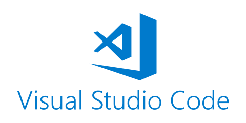

# [VS Code Raccourcis](https://flaviocopes.com/vscode/)

 

    Visual Studio Code est un éditeur de code extensible développé par Microsoft pour Windows, Linux et macOS. Les fonctionnalités incluent la prise en charge du débogage, la mise en évidence de la syntaxe, la complétion intelligente du code, les snippets, la refactorisation du code et Git intégré.

 

Par **Rachid EDJEKOUANE ⭐️**

---

## Sommaire

1. **[Copier](#1-copier)**
2. **[Coller](#2-coller)**
3. **[Couper](#3-couper)**
4. **[Tout sélectionner](#4-tout-selectionner)**
5. **[Déplacer une ligne en haut ou en bas](#5-déplacer-une-ligne-en-haut-ou-en-bas)**
6. **[Copier une ligne en haut ou en bas](#6-copier-une-ligne-en-haut-ou-en-bas)**
7. **[Mettre en commentaire](#7-mettre-en-commentaire)**
8. **[Chercher](#8-chercher)**
9. **[Remplacer](#9-remplacer)**
10. **[Créer un nouveau fichier](#10-créer-un-nouveau-fichier)**
11. **[Rechercher un fichier](#11-rechercher-un-fichier)**
12. **[Naviguer dans les fichiers ouverts](#12-naviguer-dans-les-fichiers-ouverts)**
13. **[Fermer le fichier en cours](#13-fermer-le-fichier-en-cours)**
14. **[Afficher la palette de commandes](#14-afficher-la-palette-de-commandes)**
15. **[Paramètres utilisateur](#15-paramètres-utilisateur)**

 

---

> Pour (couper, copier, coller) on peut selectionner plusieurs lignes  
> OU  
> Se positionner n'importe où sur une seule ligne sans avoir à la surligner entièrement

### 1. Copier

-   Ctrl + C

 

---

### 2. Coller

-   Ctrl + V

 

---

### 3. Couper

-   Ctrl + X

 

---

### 4. Tout selectionner

-   Ctrl + A

 

---

### 5. Déplacer une ligne vers le haut ou le bas

-   Alt + ARROW UP / DOWN ARROW

 

---

### 6. Copier une ligne en haut ou en bas

-   Shift + Alt + ARROW UP / DOWN ARROW

 

---

### 7. Mettre en commentaire

-   Ctrl + /

 

---

### 8. Chercher

-   Ctrl + F

 

---

### 9. Remplacer

-   Ctrl + H

 

---

### 10. Créer un nouveau fichier

-   Ctrl + N

 

---

### 11. Rechercher un fichier

-   Ctrl + P

 

---

### 12. Naviguer dans les fichiers ouverts

-   Ctrl + Tab

 

---

### 13. Fermer le fichier en cours

-   Ctrl + W

 

---

### 14. Afficher la palette de commandes

-   Ctrl + Maj + P

 

---

### 15. Paramètres utilisateur

-   Ctrl + ,

 

---

**[⬆ retour au sommaire](#)**
